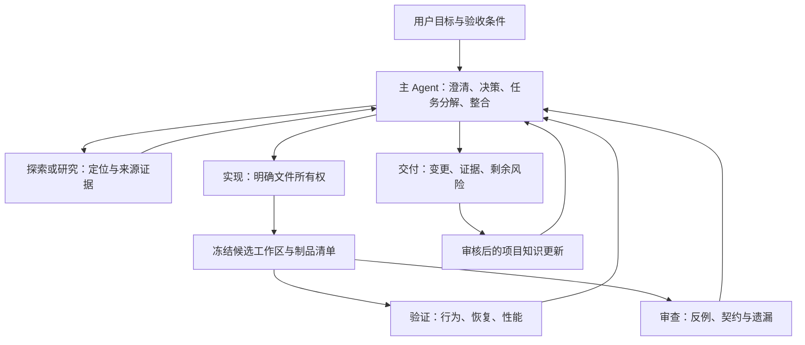

# GOGG 编程 Agent 与长期记忆体系设计提案 v1（历史归档）

此版已由 [v2 设计入口](../agent-system-design.md) 取代，仅保留设计历史。
其中较小模型分工、目录布局和实施优先级不再是当前推荐。不要将本文件默认加载为项目指导。

日期：2026-09-04。状态：供评审的设计，尚未实施或评测。

本提案只设计研发协作、上下文、记忆、恢复和验收机制。网站业务架构、
数据库选型和部署拓扑留到后续。提案不会自行成为强制规则；当前用户要求、
AGENTS.md 和既有工程约定仍然适用。

## 1. 推荐结论与成功标准

推荐采用 **Codex 原生执行能力 + 单一主控 + 按需专家 + 独立验收 +
版本化知识库**。先把工作协议跑通，再以真实失败驱动薄调度器和检索索引的建设。

“最好”需要用本仓库的结果来定义：需求完成率、遗漏回归、性能证据、跨会话恢复、
用户纠正次数，以及每个被验收任务的总时间和资源消耗。模型排名和 Agent 数量
不能代替这些指标。本轮没有进行模型对比、性能测试或自动化故障恢复实验。

用户的长期产品目标转化为 Agent 的验收责任：

| 用户目标 | Agent 必须准备的证据 |
|---|---|
| 单机稳定 | 冷启动、重启、持续运行、资源增长和故障恢复记录 |
| 性能高、内存小 | 同数据、同负载、同环境下的延迟、吞吐、RSS、分配和 CPU 对比 |
| 自动管理抓取 | 限流、取消、断点、重试、终态、重复请求和恢复场景 |
| 历史版本数据集存档 | 版本来源、内容校验、完整性、重放和恢复演练 |
| 后续多机 | 在对应阶段验证并发归属、重复任务、进程丢失及网络故障 |
| 商业化维护 | 可追溯依赖、权限边界、升级兼容、操作手册和可执行回退方案 |

这些是后续任务契约的维度，不是本轮已经达到的产品指标。
具体硬件、数据量、并发量和 SLO 未给出，应在业务重构开始前建立实测基线。
研发 Agent 的部署不依附于网站生产进程；网站迁到多机也不要求 Agent 同时分布式化。

## 2. 当前已核实的起点

- 本地 `codex --version` 为 `codex-cli 0.153.2`。
- `.codex/config.toml` 的持久化默认是 `gpt-5.6-sol` / `xhigh`，最多三个子 Agent。
- 已有 `gogg_explorer`、`gogg_verifier`、`gogg_reviewer` 角色。
- 已有 `AGENTS.md`、`docs/ai/README.md`、`docs/ai/project-memory.md` 和 ADR 目录。
- 已启用原生 Memories，但 `disable_on_external_context = true`：使用网页、MCP
  等外部上下文的会话不会成为原生记忆生成输入。这与当前官方说明一致。
- 当前工作区有用户尚未提交的 TFT、生成文件及项目记忆变更；后续基线必须包含
  实际任务相关的未提交内容，不能把 HEAD 当作完整工作区。

当前会话模型、磁盘默认模型、子 Agent 角色指定模型是不同层次。
修改主模型不能被当成所有角色都已切换。配置升级需要验证实际加载结果。
以上是本轮读取的状态，不是对现有全部规则有效性的审计。

## 3. Agent 组织与模型分配



图中是职责，不是同时启动的全部进程。默认一个主 Agent；有独立任务时启动
一至三个子 Agent，保持当前并发上限。普通实现可由主 Agent 完成。

| 职责 | 输入与输出 | 建议模型策略 |
|---|---|---|
| 主控、架构和跨层整合 | 目标、约束、证据 → 任务契约与最终结果 | Astra，复杂任务优先较高推理 |
| 核心实现 | 已明确的契约与文件集 → 补丁、局部验证与假设 | Astra；Sol 作为评测比较项 |
| 探索与资料核实 | 一个有界问题 → 文件/符号/原始来源 | 复杂路径 Astra 或 Sol；常规扫描再评估 Terra |
| 独立验证 | 冻结候选、验收规则、固定数据 → 可复现结果 | Astra 或 Sol，实际执行交给测试工具 |
| 独立审查 | 原始需求、候选 diff、相关契约 → 可定位的问题 | Astra；高风险时增加不同上下文的 Sol 审查 |
| 提取和格式化 | 已核实的固定输入 → 结构化候选记录 | 规则脚本优先；必要时评估 Luna |

这里的 Astra 指 `gpt-6-astra`。当前官方模型页将其列为复杂代码、工具和研究工作
的最强能力选项，但这不是它在 GOGG 上的实测结论。账号、客户端和登录方式决定
可用性；本提案不修改现有 Sol 默认。推理级别使用当前模型和客户端明确支持的值，
不假设所有模型都支持相同枚举。[官方模型说明](https://learn.chatgpt.com/docs/models)

针对模型特点，任务说明应给出观察得到的目标、可用材料、边界和完成标准；
让 Agent 自主决定常规步骤。用检索和执行补足知识时效性，用外部检查点补足会话
连续性，用反例和测试校正判断。更长上下文和更多推理不能保证事实或实现正确。

子 Agent 不以自由讨论形成共识。任务信封包含：

```yaml
task_id: refactor-001
objective: 一个可观察、可验收的结果
baseline: 基准 commit 加工作区快照清单
inputs: 原始需求、相关契约、必要证据的引用
owns: 明确路径或只读责任
dependencies: 必须等待的任务及其制品
acceptance: 可运行检查和预期结果
permissions: 本任务已有授权及边界
budget: 适用的时间、并发、尝试上限
deliverable: 补丁或发现、证据、假设、尚未验证内容
```

不存在真实读取/执行证据的结论只能标为假设。主 Agent 必须等待相关结果并解决
冲突；优先比较原始材料和可复现结果，不用 Agent 投票判断正确性。
审查者先根据原始需求列反例，再读取实现说明，降低被实现者解释带偏的风险。
不同模型可以提供另一个视角，但不能假设错误在统计上独立。

官方 Codex 子 Agent 指南明确建议从读多写少的探索、测试和归纳开始，指出
并行写入的冲突与协调成本。[子 Agent 文档](https://learn.chatgpt.com/docs/agent-configuration/subagents)

## 4. 写入所有权、环境和资源调度

第一阶段保持主 Agent 为主要写者，子 Agent 读、审查或在专用环境运行检查。
有充分独立性时才允许并行写入：每个写者拥有独立 worktree、文件集和任务制品。
共享 schema、迁移序号、生成文件、锁文件和公共接口由主 Agent 协调，按依赖顺序整合。

worktree 隔离文件和 index，但共享 Git 对象与多数 refs，也不隔离数据库、进程、
网络、缓存或密钥。进程和服务需要独立端口、测试数据目录、数据库或 schema，
必要时使用容器或 OS 权限隔离。[Git 官方说明](https://git-scm.com/docs/git-worktree)

对存在未提交修改的任务，快照必须记录 tracked diff、任务相关 untracked 文件、
配置模板、依赖锁及所需文件内容哈希。不得只从 HEAD 创建工作区后声称保留了用户状态。
忽略目录中的凭据和业务数据不自动复制；制品通过明确清单引用。
没有提交授权时，使用补丁和文件清单表示候选，不自动创建提交。
基线清单覆盖完整 `git status`；未纳入的 untracked 文件及已知 ignored 运行输入
逐项或按明确类别记录排除理由。验证前检查实际依赖没有读取未声明输入，
不能仅凭 Agent 预判“与任务无关”忽略可能改变测试结果的文件。

验证期间候选只读。格式化和代码生成会改文件，应在候选冻结之前完成，或在
验证副本中运行并只回报差异。测试若修改源码，结果作废并调查。
整合后的候选需要相应的集成验证；组件单独通过不能代替最终组合通过。

Agent 并发与构建/测试并发分开限流。单机起步最多一个重型集成或性能测试任务；
性能采样时暂停竞争性构建、索引和其他负载，并记录运行中的服务。
后续根据实际 RSS、CPU、磁盘和模型额度调整，不预先承诺调度器占用数值。
原生子 Agent 上限仅作用于单个 session；多个会话不共享这把锁。阶段 A 同一
仓库只开启一个写入会话；无人值守阶段需要仓库级调度锁、全局资源限额和过期结果
拒收。结果携带候选哈希，不能把旧审查结果验收到主控后来修改的候选上。

## 5. 任务状态与中断恢复

任务状态由可验证事件推进，包含修订闭环：

`proposed → scoped → implementing → candidate_frozen → evaluating → reviewable → accepted`

`evaluating → changes_requested → implementing` 表示验证或审查要求修改。
同一候选的验证和审查可并行，各自记录 `pending / passed / failed / not_required`。
验收读取 `{candidate_revision, contract_revision, verify_status, review_status,
unresolved_findings}`；只有必需关卡通过且阻断问题已解决才可接受。
`not_required` 必须由任务范围和验证矩阵说明理由，不能用于绕过失败。
源码或生成文件变化会创建新候选 revision，旧关卡状态不能直接迁移；
新候选重新完成适用检查和审查。

`needs_input`、`environment_blocked`、`failed`、`cancelled` 保存原因及恢复条件。
`accepted` 指达到当前授权范围内的验收条件，不代表已经发布。
模型的“已完成”文本不能直接把任务改为通过；结果检查器必须验证候选哈希、
必需检查的真实退出状态和未解决问题。

每个任务有三个主要制品：

1. **契约**：目标、范围、基线、约束、不变量、验收和回退要求。
2. **检查点**：当前阶段、已做/未做、工作区引用、外部操作状态、下一步及阻塞。
3. **证据清单**：运行命令、时间、退出码、日志位置、工具与模型版本、数据与候选哈希。

清单同时记录验收契约 revision、实际 model/effort、Codex/SDK/生成器版本和
角色/Skill/hook 配置哈希。缺失能力或发生模型 fallback 时显式记录，不静默替换。
无人值守阶段用追加事件保存状态变化，事务性检查状态版本并更新投影；单一控制
写者负责队列与租约，恢复时由事件核对投影。格式升级需要兼容或迁移策略。

多小时工作使用一份可恢复的执行计划，随里程碑更新，不逐次复述工具调用。
OpenAI 的代码现代化实践采用持续更新计划、契约和并行结果比较，可作为参考；
它不是 GOGG 的验收证明。[代码现代化实践](https://developers.openai.com/cookbook/examples/codex/code_modernization)

恢复会话时先核对任务 ID、工作目录、基线与当前文件状态，再读取未完成步骤。
保留聊天记录只是辅助手段。若代码、配置或数据改变，相关验证必须重新判定。
恢复已有 session 使用明确 ID；多任务环境不依赖 `--last` 寻找目标。

在引入无人值守 runner 后，再实现以下持久化机制：

- `task_id` 标识目标，`run_id` 和 `attempt` 标识执行尝试。
- 每个工作区/外部可变资源只有一个有效租约；租约有心跳和递增代次。
- 写入代理核对代次，拒绝过期执行者；重试前确认旧进程已经结束。
- 先保存操作意图，再执行有副作用的步骤，再记录结果与证据。
- 在“操作完成但结果未记录”的窗口崩溃时，先查询真实状态再恢复，不直接重放。
- 只有支持幂等键、可查询状态或可靠补偿的副作用才进入自动恢复路径。
- 取消需停止所属进程及子 Agent，保存状态；终止聊天不等于所有子进程已结束。

租约记录本身无法阻止任意 shell 写入。真正的隔离依赖 runner 对工作区、进程和
工具入口的控制，必要时由 OS 隔离实施。这里不承诺通用 exactly-once 执行。

Codex 已支持 `codex exec --json`、`--output-schema`、按 ID 恢复会话；本机帮助
已确认这些入口。JSON Schema 约束输出形状，不证明内容真实。
[非交互执行](https://learn.chatgpt.com/docs/non-interactive-mode)

## 6. 长期记忆：各类信息只有一个权威归属

| 信息类型 | 权威存放位置 | 更新机制 |
|---|---|---|
| 必须遵守的规则 | 根目录及适用子目录的 AGENTS.md | 工程约定变化时审查更新 |
| 架构决定和取舍 | docs/architecture/adr/ | 决策被接受后记录；后继 ADR 指明替代关系 |
| 当前模块事实 | 项目记忆索引及按模块拆分的知识文件 | 代码或契约变化时核实、更新 |
| 已证明的失败教训 | 带原因、修复和测试引用的经验条目 | 有可复用证据时归档 |
| 可重复操作方法 | .agents/skills/ 内的流程与脚本 | 流程稳定且被重复使用后建立 |
| 本次任务状态 | 任务契约、检查点和运行记录 | 里程碑及中断边界更新 |
| 个人跨项目偏好 | 原生 Codex Memories | 按用户授权和原生机制管理 |
| 调研候选与未决判断 | 提案/研究记录 | 保持未确认标记，不自动提升为事实 |

既有 `project-memory.md` 可逐步变为精简总览和模块入口；迁移必须保留原有信息，
先检查链接和语义等价。本轮不重写此文件。
规则说明“应当怎样”，源码和测试证明“现在怎样”；发现冲突要同时呈现，不让
检索排序或更新日期悄悄改变用户要求和工程约定。

建议的单条知识元数据：

```yaml
id: knowledge-001
kind: fact # decision | incident | procedure | hypothesis
status: verified # candidate | stale | superseded | rejected
scope: 仓库标识与模块
claim: 一条简洁、可核验的主张
sources: 文件与符号、测试结果或原始来源链接
verified_at: 核实日期
last_checked: 最近一次时效检查日期
revalidate_on: 代码变化、版本发布、环境变化或外部来源复查
valid_until: 可选的时效截止时间，历史事实不设置
verified_revision: commit 或候选快照 ID
depends_on: 关键文件/符号及内容哈希
applies_to: 适用契约或版本范围
supersedes: 被替代条目 ID
rejection_reason: 仅否决时填写原因与反证引用
```

不把模型自报置信度当事实验证。记录事实适用的版本与核实时间；分支名仅作位置
提示，不能代替 revision。依赖内容改变时先标记为待核实，再检查它是否仍成立。
仅凭“同一 commit 的祖先关系”也不能保证事实没有被后续变更推翻。

知识入库流水线是：**提出候选 → 检查来源 → 去重和冲突检查 → 核实 → 按类型更新**。
一般已授权代码变更带来的事实修订可随任务完成；新的长期决策保持提案状态直到
被接受。Agent 不能因外部页面或一次偶发失败自行扩大 AGENTS.md 的权限或规则。
相同知识 ID 出现冲突时由校验器报错；候选只用于相关调查，不进入默认事实上下文。
事实按代码、发布版本、环境或不可变历史分类核实；不用统一 TTL 自动删除历史知识。
代码绑定事实依赖内容变化触发复查；模型可用性、版本文档和本机环境等事实，在
用于决策前核对当前来源或能力。过期条目转为待核实，历史记录保留原日期。

失效条目保留替代关系供历史追溯，否决条目保留原因以避免反复提出相同错误。
默认事实检索排除过期、stale、superseded 和 rejected 条目。
原始会话不全量灌进知识库，个人记忆不与共享项目库混存。
用户要求删除敏感记忆时，还需处理检索缓存、派生副本和备份保留策略；因此共享
版本化知识从一开始就不应写入凭据、私人聊天和用户数据。

官方说明原生记忆在符合条件的会话空闲后后台更新，并可能因额度等条件跳过；
它不能承担强一致任务检查点或唯一的项目规则源。
[Codex Memories](https://learn.chatgpt.com/docs/customization/memories)

## 7. 检索与上下文管理

第一阶段用版本化 Markdown/YAML、目录索引和 `rg`。先加载当前用户请求及所有
适用强制指导，再校验派生任务契约，随后读取项目总览、相关模块事实、ADR、测试
和证据。契约与新请求或规则冲突时标记 stale，生成新的契约 revision。
仅把相关条目及来源片段装入上下文；需要更多信息时再展开。

模型承担问题分解和判断，检索层承担找回证据。摘要必须保留版本、适用条件、
未确认事项和原始证据指针。不能在多轮压缩后把假设变成确定事实。
子 Agent 默认接收任务所需材料；高风险独立审查使用重新构建的上下文，减少
不必要的整段聊天继承。不要通过复制提示词绕过工具实际的上下文继承限制。

官方也提供 Astra 的实验性跨上下文窗口笔记与同任务历史搜索，受账号、登录方式
及客户端支持限制，默认关闭。后续可纳入恢复评测试点；这属于同一任务的上下文
管理，与跨会话个人记忆、Git 项目事实是三个不同层次。即使实验开关不可用，
任务检查点和知识检索仍应独立工作。
[模型与实验性上下文管理](https://learn.chatgpt.com/docs/models)

出现可重复的检索遗漏后，再引入独立 SQLite FTS5 索引：

1. 先按仓库、分支适用性、状态和模块过滤。
2. 再做路径、符号、关键词全文检索。
3. 若真实测试表明语义改写检索不足，再增加可选向量检索。
4. 需要关联大量 ADR、事故与模块依赖时，再评估图结构。

SQLite 只存可重建的知识索引；任务状态使用独立的持久化表/库并备份。
重建检索索引不得删除任务状态。索引需记录来源内容哈希、格式版本和构建版本。
先追求检索正确性、失效检测和“未知就回查”，再追求召回规模。

MCP 可在跨工具共享检索时提供只读 `search/get/evidence`；它是访问入口，不是
记忆算法或权威数据库。初期本地检索不必启动常驻 MCP 服务。
Skill 承载按需展开的流程，避免把所有操作细节塞入 AGENTS.md。
[Codex 定制层次](https://learn.chatgpt.com/docs/customization/overview)

## 8. 验证与验收关卡

主 Agent 在实现前定义不变量和可观察验收。高风险任务由 verifier 根据原始需求
补反例，避免测试只重复实现者的假设。

| 关卡 | 判断依据 |
|---|---|
| 范围与完整性 | 用户已有变更清单、候选快照、文件所有权、依赖与生成文件一致性 |
| 基础正确性 | 适用格式、编译、静态检查、类型检查和聚焦行为测试 |
| 边界与恢复 | 契约、终态、重试、幂等、取消、进程崩溃和重新连接 |
| 用户结果 | 关键浏览器流程或端到端结果符合原始需求 |
| 性能与资源 | 同条件基线比较，确认延迟/吞吐改善没有以错误或资源增长为代价 |
| 独立审查 | 可定位的问题得到解决，未验证项如实标注 |
| 最终交付 | 适用检查完成、证据可复现、文档对应最终候选 |

沿用 AGENTS.md 的验证矩阵。行为变化增加必要测试；小型可逆文档或样式修改
不套用全部关卡。重要重构考虑固定输入下的新旧结果比较、性质测试、故障注入。
故障注入只在专用测试环境进行。

性能记录至少含硬件、OS/容器限制、版本、数据集和工作负载哈希、缓存冷暖状态、
并发、持续时间、吞吐、延迟分布、错误率、RSS/heap/分配和 CPU。
重复次数按噪声与任务风险确定；禁止不同硬件或不同输入直接宣称优化百分比。
归档相关任务同时验证从归档恢复或重算，不用“文件写成功”代替可恢复性。

候选内容在测试后改变时，旧证据不自动沿用。至少重新运行受影响检查；最终候选
必须有覆盖其变更的证据。把代码失败、测试环境失败、权限/DNS 阻断和未运行分开报告。
Agent 不能通过删断言、改验收或隐藏失败获得完成状态。

## 9. 工具选择和权限实施

| 能力 | 起步选择 | 何时升级 |
|---|---|---|
| 编码与协作 | Codex CLI/IDE、原生子 Agent | 真实任务需要可编程调度时用 SDK |
| 任务编排 | 任务文件、明确检查点、少量验证脚本 | 无人值守任务队列、崩溃恢复和资源调度成为实际需求 |
| SDK | 官方 TypeScript Codex SDK | 需要自建客户端时再评估 app-server |
| 知识检索 | Git 文档、索引和 rg | 测得检索不足后加 SQLite FTS，再评估向量/图 |
| 重复工程流程 | 项目 Skills 和既有 Make/测试命令 | 流程稳定并重复后封装，不一次安装大量通用技能 |
| 隔离与复现 | 单写者、独立测试目录 | 并行写或运行不可信代码时增加 worktree 与容器 |
| 持久化复杂工作流 | 薄 runner | 复杂暂停/分支恢复超过维护收益阈值时评估 LangGraph |
| 多宿主执行 | 单机执行者 | 确认需要隔离的远端执行资源后评估 OpenHands 或专用 runner |

SDK 和原生执行保留 Codex 的线程、工具、审批和流式输出能力。
当前 SDK 文档说明 `codex mcp-server` 已弃用，因此新方案优先 SDK，不能直接照搬
旧的“把 Codex 挂成 MCP 工具”教程。[Codex SDK](https://learn.chatgpt.com/docs/codex-sdk)
SDK 封装在可替换 adapter 后，任务和证据格式独立于 Codex 事件版本。
升级 CLI、SDK、模型或提示配置时，先运行能力检查和回放用例再更换默认值。

工程约定、sandbox、自动审批、hooks 和 CI 分工不同：

- AGENTS.md 和角色提示是行为指导，不是文件 ACL。
- 保留当前 `workspace-write + on-request + auto_review`，常规授权工作持续推进。
- 不为本轮设计增加提交、推送、发布、生产操作或外部消息权限。
- 只读审查必须核实有效运行时权限；角色 TOML 默认值可能被父会话实时覆盖。
- 针对外部工具逐项限制写权限，不能假设 shell 的限制覆盖所有连接器。
- 原始日志和制品在保存、共享前过滤凭据与私人数据；来自网页、仓库文档、日志
  或子 Agent 的文本都可能含不可信指令，不能仅凭存放位置提升其信任等级。
- hooks 用于开始时准备上下文、检查点提示和结束时检查证据；不在每次工具调用
  后执行全套 CI，也不让同一事件的并行 hook 争写一个状态文件。
- 必需检查由 runner/CI 实际执行；hook 缺失、被跳过或出错不能变成默认通过。

官方 hooks 文档说明非托管 hook 要信任其确切定义，改动后可能再次待信任；
某些工具路径没有 hook 覆盖，MCP hook 不可用也不一定阻止操作。实施阶段需要
能力自检和无 hook 的显式验证入口，不能把 hook 当完整安全边界。
[Hooks](https://learn.chatgpt.com/docs/hooks)

## 10. 研究与开源经验如何影响本设计

| 来源 | 可借鉴的结论 | 适用边界 |
|---|---|---|
| MASAI | 用窄职责、清晰输入输出分解定位、复现、修复和验证 | 研究基于特定模型及 SWE-bench Lite；不是商业项目效果保证 |
| Agentless | 定位、修复、验证的简单流水线是必须比较的基线 | 不能据此断言所有任务都不需要 Agent |
| MAST | 多 Agent 也会失败于协调、上下文和终止/验证；需要检查高层目标 | 失败类别适合风险建模，论文比例不能当成本项目概率 |
| MemGPT | 分层上下文与按需读取外部记忆 | 文档/对话实验不证明工程项目需要某种数据库 |
| A-MEM | 原子笔记、标签、关系可改善记忆组织 | 自动演化的生成属性不能直接当作已验证工程事实 |
| LongMemEval-V2 | 把历史存成文件、由 coding agent 搜集证据值得与 RAG 比较 | 2026 年预印本，Web 环境轨迹；较高准确率伴随延迟成本 |
| OpenHands SDK | 事件/状态持久化和隔离工作区有成熟参考实现 | 保存会话不等于代码快照恢复或外部副作用只执行一次 |
| LangGraph | 检查点、步骤持久化与恢复重放有现成机制 | 未完成步骤可能重放，仍要处理幂等和工作流版本兼容 |

来源：[MASAI](https://arxiv.org/html/2406.11638)、
[Agentless](https://arxiv.org/html/2407.01489)、
[MAST](https://arxiv.org/html/2503.13657)、
[MemGPT](https://arxiv.org/abs/2310.08560)、
[A-MEM](https://arxiv.org/abs/2502.12110)、
[LongMemEval-V2](https://arxiv.org/abs/2605.12493)、
[OpenHands 持久化](https://docs.openhands.dev/sdk/guides/convo-persistence)、
[OpenHands SDK](https://github.com/OpenHands/software-agent-sdk)、
[LangGraph 持久化](https://docs.langchain.com/oss/python/langgraph/persistence)、
[LangGraph 恢复与兼容](https://docs.langchain.com/oss/python/langgraph/backward-compatibility)。

本提案借鉴开源工程模式，不在本轮引入其依赖。实际采用前核查锁定版本的 LICENSE、
依赖树、维护成本和需要部署的服务。商业可用性应基于将采用的具体组件判断。
Letta Code 的 Git 记忆文件和历史检索也值得参考，但它是另一套完整执行体系。
只有共享持久 Agent、记忆并发和跨工具需求确实超出现方案时，再做隔离试点；
不让两套执行体系同时接管同一工作区或自行改写对方的规则。
[Letta Code 官方仓库](https://github.com/letta-ai/letta-code)

## 11. 如何证明这套 Agent 体系有效

从 GOGG 历史真实任务选取约 12–20 个试点，覆盖定位、跨层修改、重试/终态、
生成文件、性能、旧版本数据和跨会话恢复。数量是起步建议，不是统计充分性保证。
为每题固定输入、基线、可访问工具和验收，并留一部分任务作为未参与调优的保留集。
历史回放恢复任务发生时的代码、规则、项目知识和可见测试；标准答案、后来的
修复提交与隐藏验收放在 Agent 无法访问的独立评分环境。使用独立评测配置关闭
原生记忆的使用和生成，不删除用户现有记忆。“携带当前项目经验”的效果作为另一
实验组报告，避免未来知识泄漏夸大能力。基础模型可能已见过公开任务的风险也需记录。

分两步比较，避免同时更换模型和流程后无法归因：

1. 固定模型，比较原流程、任务契约与检查点流程、再加独立审查/检索的增量效果。
2. 固定流程，再比较 Sol、Astra 及需要时的角色组合。

记录完成与回归、遗漏/误报、首次通过率、人工纠正次数、运行时间、总 token 和
每个验收成功任务的成本。模型自评只作线索，评分依赖可运行验收和人工抽查。
对随机波动重复代表性任务，报告失败样例与分布，不只报平均值。

专门测试体系自身：

- 中断并换新会话，核实目标、当前进度、真实文件和下一步是否恢复。
- 修改一条知识依赖，核实它是否停止被当成已验证事实使用。
- 在另一分支提出相似问题，核实它不会直接套用错误版本结论。
- 注入缺失证据、伪造“通过”文本和不可信资料中的指令，核实不会被提升为事实。
- 若已有 runner，在步骤执行后但结果记录前模拟崩溃，验证状态核对与重复操作处理。
- 停掉检索索引或 hook，核实回退路径仍能工作且必需验收不被绕过。

出现明显回归就回退该模型、提示、检索或流程版本。改进依据失败归因：遗漏上下文
修路由，缺少反例补验收，流程重复才写 Skill；不把每次偶发错误变成永久提示词。

## 12. 分阶段落地和建议目录

**阶段 A：可用的工作协议。** 在现有 Codex 基础上补任务契约、检查点、证据模板，
为复杂任务配置独立审查。整理项目知识的模块入口。先完成少量试点，核实新会话恢复。
无需额外常驻数据库服务，也无需网站业务重构。

**阶段 B：有依据的自动化。** 将稳定流程封装为少量项目 Skills 和验证脚本；
有无人值守需要时，用 TypeScript SDK 做薄 CLI runner，独立 SQLite 保存任务状态，
知识索引单独可重建。加入资源限流、失败分类、租约和副作用状态核对。

**阶段 C：按测量结果扩展。** 检索不足再增加语义检索；任务量和隔离需求不足以
支撑多宿主时保持单机。确需远程执行才设计调度服务与独立执行者，禁止通过共享
网络目录让多机共同写 SQLite/WAL 或同一工作区。

建议结构；除本设计文件外，下面的新增路径尚未创建：

```text
AGENTS.md                           必须遵守的简洁规则
.codex/config.toml                  经过验证的运行配置
.codex/agents/                      角色与能力配置
.agents/skills/                     已稳定的重复流程
docs/ai/README.md                   使用入口
docs/ai/project-memory.md           项目总览与知识路由
docs/ai/knowledge/                  按模块事实和失败经验
docs/ai/tasks/                      需要长期保留的契约与收尾摘要
docs/ai/evals/                      测试任务、评分标准和对比结果
docs/architecture/adr/              重大决策与替代关系
tools/agentctl/                     第二阶段的薄 runner 与校验脚本
.local/agent-system/                忽略的任务状态、缓存和运行制品
```

版本化任务文档和本地活动状态通过 task ID 关联，不维护两份可编辑进度真相。
日志、浏览器轨迹、性能原始数据留在有清单的制品目录；清单记录哈希、保留政策和
备份位置。摘要丢失可从证据恢复，索引丢失可重建，活动任务状态必须单独备份。

当前下一步是实施阶段 A 并执行试点，再决定阶段 B 的具体工具。
本轮产物是设计和来源核实；尚未安装框架、启用 hook、修改模型默认或运行产品测试。
