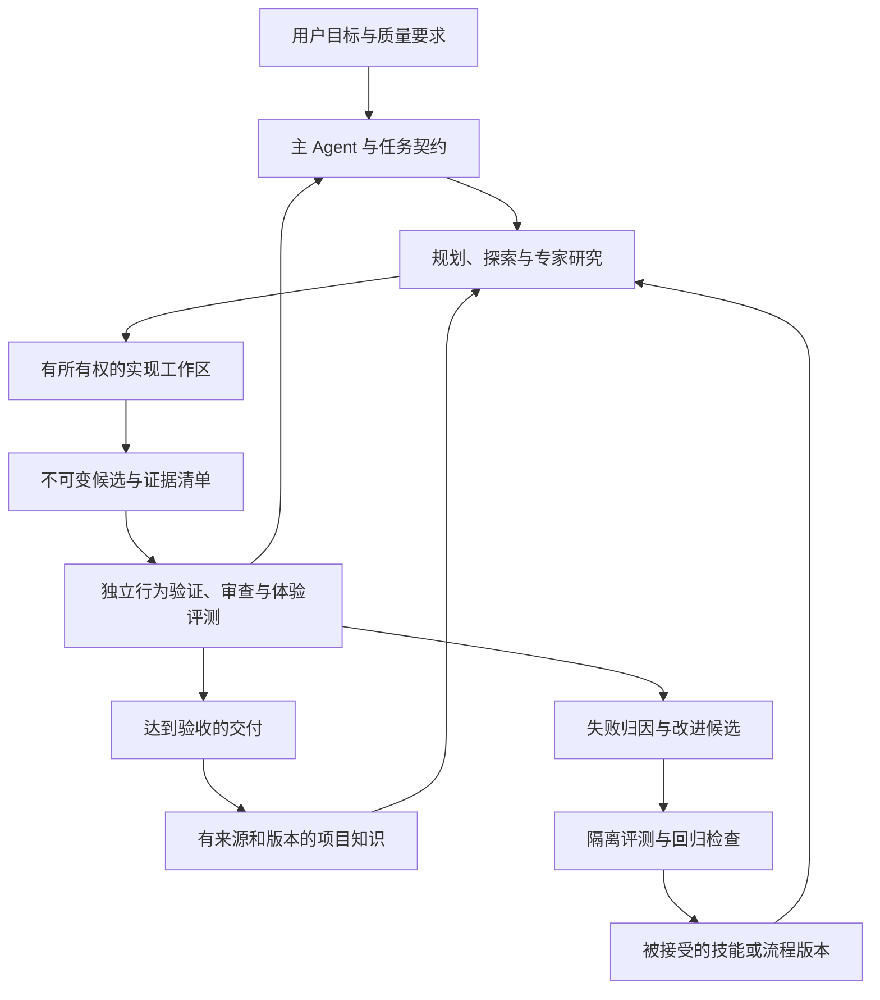

# 组织与执行设计

状态：v2 提案。入口：[设计总览](../agent-system-design.md)。

## 1. 三个闭环

交付闭环解决当前问题；知识闭环保留事实与理由；学习闭环改进以后的做法。
三者可以由同一主 Agent 协调，但状态、权限和验收独立。
“可学习”默认指外部经验、经过评测的技能和工具改进，不意味着能够自动训练
或修改 Codex 基础模型权重。

## 2. 模型和专家

质量基线为 `gpt-6-astra`。主控、研究、重要实现、验证、审查、知识提炼和学习
候选评估均优先 Astra。复杂任务采用较高推理；`max/ultra` 仅在实际模型和接口
支持时使用，记录请求值与实际值。禁止静默降级；保存能力或额度不足的原因和
检查点，继续不依赖该能力的已授权工作。

官方说明 Astra 适合困难的多步骤工作，对指导文件更敏感，可能少委派，也可能
对小改动过度测试。因此指导需明确持续推进、委派触发、指令优先级和适用验收。
[Astra 官方指南](https://developers.openai.com/api/docs/guides/latest-model)

| 角色模板 | 触发条件 | 有界交付 |
|---|---|---|
| 主控/集成者 | 每个目标 | 契约、依赖图、决策、整合和最终证据 |
| 执行路径专家 | 未知跨层行为 | 文件/符号及实际调用关系 |
| 产品与体验专家 | 用户流程或交互重构 | 用户任务、原型、可用性和无障碍检查 |
| 统计与推荐专家 | 数据结论或个性化 | 假设、数据可得性、识别条件、实验协议 |
| 性能与可靠性专家 | 单机优化、任务恢复、多机 | 固定负载、剖析、失效场景和结果 |
| 实现者 | 范围可隔离 | 指定工作区补丁和局部证据 |
| 验证者 | 已形成候选 | 行为、数据、浏览器或性能证据 |
| 审查者 | 复杂/高风险候选 | 原始需求出发的反例和可定位问题 |
| 知识维护/学习者 | 阶段完成或重复失败 | 带证据的知识、技能或工具改进候选 |

这些是模板，不是全部常驻进程。起步保持主 Agent 加最多三个子 Agent，按阶段
复用角色。重要审查重新构建上下文，先看原始要求，再看实现解释。同模型多个
角色仍可能共同犯错，独立上下文不等于统计独立，也不替代外部验收。

## 3. 复杂问题如何推进

先列已知事实、待验证假设、约束、缺失数据、可逆试验和成功条件；再拆成可交付
行为切片并标依赖。探索缩小不确定性，实现改变明确行为。高风险决策保留可行
替代方案和取舍，隔离实验可以比较多个候选；不采用 Agent 投票判断正确性。

每次失败区分新信息、重复环境阻断和方案被反证，决定继续、换假设或保存阻塞。
不无界重试同一动作。长任务保持主目标和当前里程碑，不机械按固定 token 清空
会话，也不预设所有问题都应拆成固定时长 sprint。

子任务信封包含 `task_id / run_id / objective / contract_revision /
candidate_revision / inputs / owned_paths / dependencies / acceptance /
capabilities / resource_limit / result_schema`。交付包含证据、假设、未验证项。
阶段完成、重大用户修正、交接、取消和进程中断触发检查点。

## 4. 外层耐久流程与 Codex 执行器

优先架构为 **LangGraph 持久状态图 + 官方 Codex SDK 执行适配器**。LangGraph
只管理阶段、暂停、恢复、分支与验收关卡；Codex 管理一个阶段内的代码与工具
循环。采用官方 Python SDK 可让外层与适配器处于同一 Python 进程生态；若团队
后续选 TypeScript，也有官方 Codex SDK，需单独验证对应持久化适配器。

这更新了 v1 的薄调度器建议：完整目标已包括多队列、暂停恢复、候选关卡和学习
循环，自研通用持久工作流会增加维护风险。自建范围限制为 GOGG 任务契约、
制品协议、资源所有权、适配器和领域验收。没有成熟框架能自动补齐这些领域语义。
[Codex SDK](https://learn.chatgpt.com/docs/codex-sdk)、
[LangGraph Persistence](https://docs.langchain.com/oss/python/langgraph/persistence)

初期交互试点可原生运行；进入无人值守前验证 SDK 的有效权限、线程恢复、流式
事件、取消传播与审批承接。框架和 SDK 组合尚未在本项目实跑。

SQLite checkpoint 仅用于单宿主开发/试点；长期无人值守优先使用 LangGraph
官方生产向 PostgreSQL 后端，工程控制数据与网站业务数据隔离。单机是否共享
数据库进程需测资源与故障影响，不默认另起一套重型服务，也不把 SQLite 开发
后端直接当作已证明的长期方案。

不要让 DeepAgents、OpenHands 与 Codex 同时掌管同一个模型循环。它们可以成为
替换执行器的实验项。如果后续决定以独立 Temporal 工作流承载外层耐久调度，
则替换 LangGraph 的生命周期所有权，避免两层共同控制恢复与重试。

## 5. 状态与验收

`scoped → implementing → candidate_frozen → evaluating → reviewable → accepted`

`evaluating → changes_requested → implementing` 构成修订闭环。每次修订有
新 candidate ID；验证和审查独立记录状态，接受条件同时匹配契约、候选、数据、
环境和必需关卡。`not_required` 需由范围和验证矩阵说明，不能绕过失败。

`needs_input / waiting_external / environment_blocked / failed` 保存各自恢复条件。
取消经 `cancel_requested → cancelling → cancelled`；唯一控制器串行裁决同一 run
的取消与接受，已接受任务的取消不能追溯撤销外部动作。停止进程或撤销其写权限
后才能释放资源、启用接替写者。取消终态后的迟到结果仅入审计；需要续做时建立
显式新 attempt，不能使已取消 attempt 复活。

接受只代表满足任务授权范围；发布、推送、生产操作仍需对应
授权。已获得授权的范围持久保存，不因会话恢复反复申请。

LangGraph checkpoint 是流程阶段及 gate 汇合状态的权威源；执行账本拥有任务
认领、进程、租约、工具动作和副作用事实。账本不维护第二份可独立编辑的流程
阶段。看板由二者按 run ID 组合，只读派生。

## 6. 工作区和资源隔离

同一文件集唯一写者；主控协调公共接口、迁移编号、锁文件、GraphQL/sqlc 生成链。
多写者使用独立 worktree 和任务数据 namespace。worktree 不隔离共享 Git refs、
数据库、端口、进程或密钥，必要时使用容器或相应 OS 隔离。

候选包含 base commit、staged/unstaged diff、未跟踪文件清单及哈希。覆盖完整
git status，排除项有理由；所需 ignored 数据使用显式只读制品引用，凭据不进
快照。生成/格式化在冻结前完成，验证环境不能改作者候选。

原生子 Agent 上限仅约束单会话。仓库级锁和宿主资源配额覆盖多个会话，拒绝旧
候选的过期审查结果。Agent 并发和构建/测试并发分开调度；性能测量暂停竞争性
构建、索引和维护任务。具体资源预算通过实测配置。

## 7. 崩溃、重放和授权恢复

节点恢复可能重新执行，Codex 会话恢复不保证外部动作只发生一次。每个执行阶段
登记稳定 attempt/operation ID；节点重放先查询已有调用、进程状态和结果，再决定
重接或重试。未知结果先核对外部状态，不能盲目重新启动 writer。

执行账本先存意图，完成后登记对象标识和证据。工作区 fencing token 包含
`controller_incarnation + resource_generation`，受控写入和结果接收均核对。
恢复旧备份时生成新的 incarnation 并拒绝旧值，避免计数回退后复用有效租约。
租约过期不表示旧 shell 已停止。控制器管理进程组、取消和孤儿任务。
任意 shell 绕过受控入口时，真正隔离要靠 OS/工作区权限，不能仅依赖 lease。

不可变制品发布完成后，流程 gate 才记录其 manifest。跨 checkpoint 与账本的
动作使用可重放的幂等核对，不假设两个存储自动事务一致。持久化模式需满足阶段
完成前落盘要求，在试点验证；不承诺通用 exactly-once。

## 8. 上下文与业务智能分界

同任务上下文、个人原生 Memories、Git 项目知识是三层。Astra 的实验性跨窗口
笔记受账号/客户端限制，任务检查点需在该功能不可用时仍可恢复。
[官方上下文管理](https://learn.chatgpt.com/docs/models#experimental-context-management)

研发 Agent 学习工程经验；网站推荐/教练系统需要独立数据与用户效果验证。
工程任务成功不能证明建议对玩家有效。玩家原始资料默认不进入研发个人记忆或
共享工程知识，详细边界见[产品契约](product-contract.md)。
